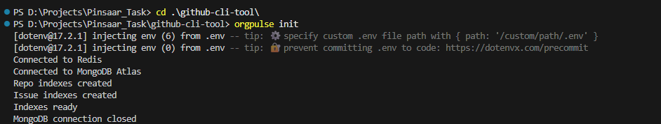
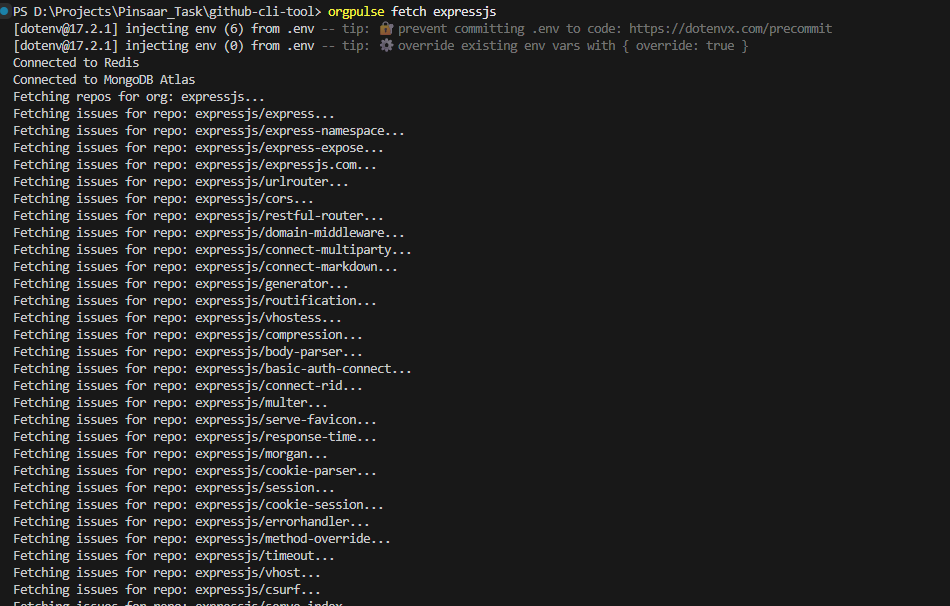
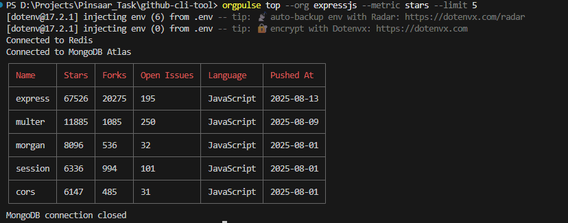
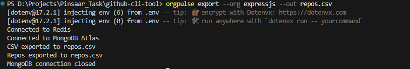
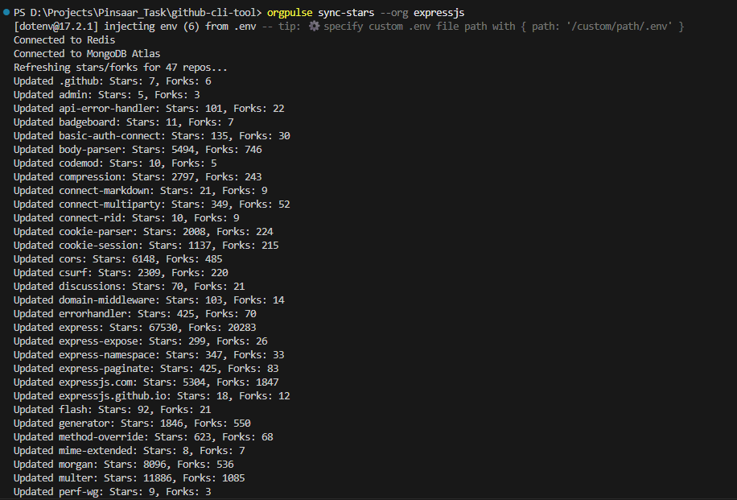
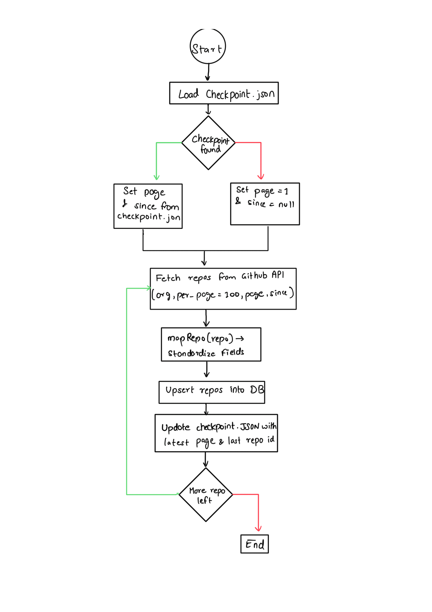

OrgPulse CLI
============

OrgPulse is a command-line tool for fetching GitHub organization repositories, storing them in MongoDB, and performing analytics like top repos, exporting CSVs, and syncing stars/forks.

* * * * *

**Features**
------------

-   Fetch public repos + issues for a GitHub organization

-   Show top repositories by stars or open issues

-   Export repository data to CSV

-   Sync stars/forks for existing repositories

-   Handles GitHub API rate limits gracefully

* * * * *

**Tech Stack**
--------------

-   Node.js

-   MongoDB Atlas

-   Redis (for caching / rate-limiting)

-   Commander.js (CLI)

-   dotenv

* * * * *

**Getting Started**
-------------------

### **Prerequisites**

1.  Node.js >= 18

2.  npm / pnpm / yarn

3.  Docker (for Redis container)

4.  MongoDB Atlas account

* * * * *

### **Clone the repository**

`git clone https://github.com/dikshantbadawadagi/github-cli-tool.git`

* * * * *

### **Install dependencies**

`npm install`

or using pnpm:

`pnpm install`

* * * * *

### **Setup environment variables**

Create a `.env` file in the root directory:

`MONGODB_URI=<your-mongodb-atlas-uri>
GITHUB_TOKEN=<your-personal-access-token>
REDIS_HOST=127.0.0.1
REDIS_PORT=6379`

> Make sure your GitHub token has repo access if required.

* * * * *

### **Start Redis using Docker**

`docker run --name orgpulse-redis -p 6379:6379 -d redis`

This will start a local Redis container on port 6379.

* * * * *

### **Run OrgPulse CLI commands**

The CLI is installed locally and invoked via `orgpulse`:

# Initialize database and create indexes
orgpulse init

# Fetch repos + issues for a GitHub org
orgpulse fetch <org-name> [--since YYYY-MM-DD]

# Show top repos
orgpulse top --org <org-name> --metric stars --limit 5

# Export repos to CSV
orgpulse export --org <org-name> --out repos.csv

# Sync stars/forks for existing repos
orgpulse sync-stars --org <org-name>`

> Replace `npx orgpulse` with `npm start --` if not globally installed.

* * * * *

### **Testing**

Run all tests:

`npm test`

Make sure your `.env` has `MONGODB_URI` set.

* * * * *

### **Rate-Limit Handling**

OrgPulse handles GitHub API rate limits gracefully. If a 403/429 occurs, the CLI will wait and resume automatically.

> For testing rate-limit handling locally, you can run multiple fetches in parallel using the built-in throttling mechanism.

* * * * *

### **Field Mapping**

-   **Kept fields:** `org`, `name`, `description`, `topics`, `language`, `stars`, `forks`, `openIssues`, `license`, `pushedAt`

-   **Dropped fields:** `watchers`, `subscribers_count`, some raw API metadata

-   **Schema compromise:** `license` is stored as a string (`spdx_id`) instead of a nested object to simplify queries.

* * * * *

### **Pagination + Checkpointing Flow (Mini Diagram)**

`[Fetch first page] --> [Save last repo ID] --> [Process data] --> [Fetch next page using checkpoint] --> [Repeat until all pages fetched]`

> Initialed & dated diagram to be hand-drawn and attached in submissions.

* * * * *

### **Debug Diary Example**

Encountered rate-limit / 403:

`Fetch failed: API rate limit exceeded (403)
Retrying in 60 seconds...`

-   **Fix:** Added checkpointing + throttling using Redis cache.

* * * * *
### **Screenshots**
### orgpulse init

### orgpulse fetch expressjs

### orgpulse top --org expressjs --metric stars --limit 5

### orgpulse export --org expressjs --out repos.csv

### orgpulse sync-stars --org expressjs

### Checkpoint Structure

### Please Find DEMO Video & Code Explanation Video in Videos Folder
### Find the videos in this [Drive folder](https://drive.google.com/drive/folders/1sos73REi6Zoh_6oeLGNM7PABi77oi7sJ?usp=sharing).

### **License**

MIT License
